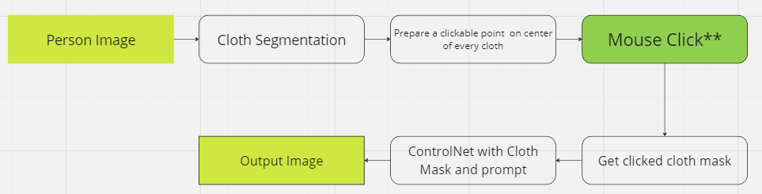
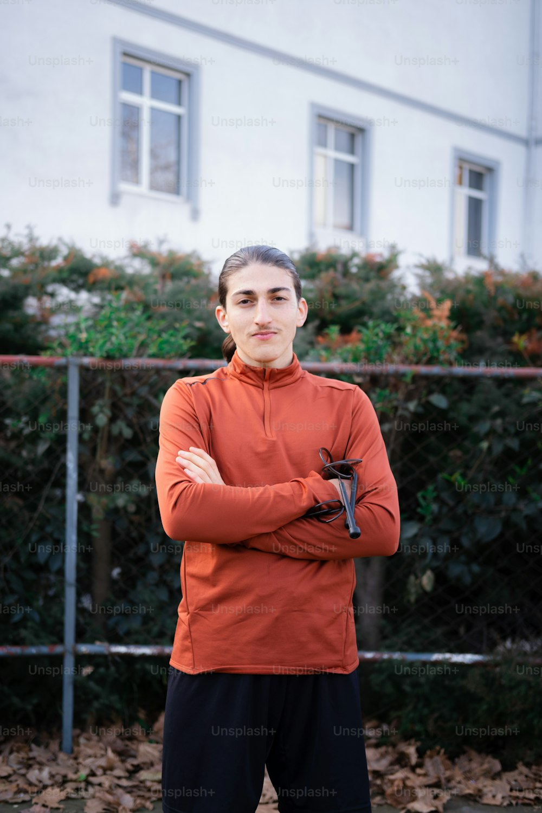
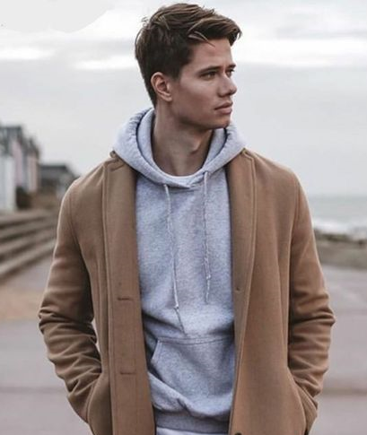

# image-inpaint
Changing Dresses via Prompting

## Project Pipeline

---
### Clothes Segmentation Example Input - Output

---
### ControlNet Example Input - Output

{:height="36px" width="36px"}

{:height="36px" width="36px"}

---
## To Do's
### Image Processing
- [ ] Filter generated masks based on model label file
- [ ] Plot a center point on every mask pieces

### Coding
- [ ] API integration
- [ ] Code arrangement as strategy design pattern

### UI & UX
- [ ] Web UI Design
- [ ] Mobile UI design (optional)
- libraries and languages (maybe) are not certain right now

### Optimization
- [ ] Model inference time optimization
- [ ] Bottleneck functions (if there are any) pruning

### DevOps
- [ ] Jenkins implementation as CI/CD
- [ ] Dockerize product
- [ ] Kubernetes